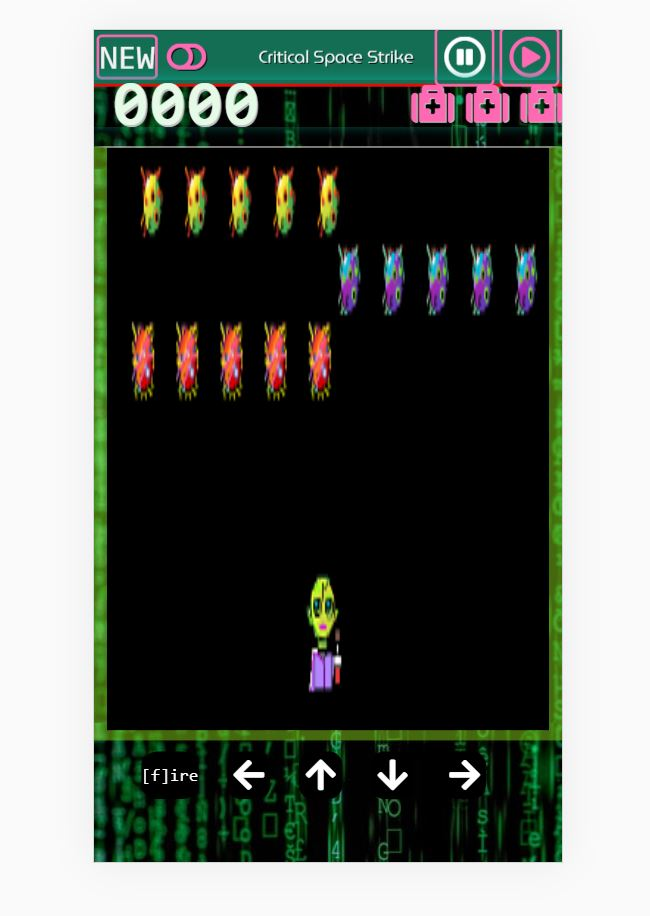

# soloproject-tier2-spacestrike
Chingu Solo Project - Tier 2 - Critical Space Strike Game

## -WARNING- Before you take on this project, know that the frame rates, and animation process can produce effects similar to strobe lights,  if you have any sensitivity to these things, especially with seizures proceed with extreme caution.
Also be aware of producing a strobe lighting effect as you create it, even if you are unaffected, this may hurt someone who plays your game. Strobe light effects should not be used in any way.  Small bits of image flash are very common in animating, just be aware of bright lighting(coloring) that can simulate a flash during the process. 
[Strobe light on wikipedia](https://en.wikipedia.org/wiki/Strobe_light)

## Overview
Create an arcade style game. Players should be able to pause, and resume game play as well as recieve a screen with some sort of recognition once they've won the game, (eliminated all the enemys). 
Most importantly have fun.  

  

  

  
## About Chingu

If you aren’t yet a member of Chingu we invite you to join us. We help our 
members transform what they’ve learned in courses & tutorials into the 
practical experience employers need and want.

Our remote team projects let you refine your technical skills and put them 
into practice while gaining new “soft” skills like communication, 
collaboration, and Agile project management. The types of skills that 
help real-world teams get things done!

You can learn more and join us at [chingu.io](https://chingu.io).

## Specifications
* Use any JavaScript, CSS framework and HTML
* Player and enemy objects/images should resize or fit in game screen on all device screen sizes. 
* The game area should cover most of the screen.  A nav bar/header should give the name of the game, and display a New Game button, A score of some sort, and some images that represent the number of lives the player has.
* There should be one player/user item in the game area that can be controlled in two ways.  
  - desktop: key presses (this can include the buttons for mobile, but movement should be capable in both ways)
  - mobile: buttons
* Player item movement should stay within the game area at all times. The Player item should not be able to cross paths with the enemy items.
* Three rows of enemy items. Each row should contain at least five enemies.
  - Each row of enemies should move as the game runs in a repetitive, or looping manner horizontally across the game screen.
  - Enemy item movement should be restricted to thier individual rows, and not leave the game screen area. 
  - The rows should not cross, or animation conflict in anyway with player item movement.
  

  
  

  
  ## Tier 2 Special Specifications
 - [ ] Player should be able to pause, and resume the game. 
 - [ ] Enemy fire, is not required for a complete project.
 - [ ] Players should cast out some object to interact with/remove the enemy objects. Code should handle the overlap/collision/proximity of the images being within presence of each other.  
 - [ ] Lives of player being affected by game play is not a requirement for this tier. 
 - [ ] A page/screen change should indicate to player when the game is won.
 - [ ] A score should be visible and change upon the player successfully removing enemy objects.
 - [ ] New game button should reset all game play / score / objects
 
  *Other*
  
- [ ] Your repo needs to have a robust README.md
- [ ] Make sure that there are no errors in the developer console before submitting

  ## More(Optional)
  * There is an assets file in this repo for images if you so choose.  You can use whatever image you wish for your player and enemy, but enemys should have a variety of three distinct visual types.  They can be apples, oranges and bananas if you really wish, but that's a lot of fruit. The player object/image can be a ship, or even a fruit bat if you want.  I mean, there is a lot of fruit. 
  
 It is ok if your game resets on refresh.  If you complete the project in plenty of time and wish to add bonus features remember to keep your completed solo submission safe. Here are some suggestions:
 
 - [ ] A game start screen, so that the game only starts after player/user pushes some kind of 'start game' button.
 - [ ] Add a second interaction between enemy or environment that can remove a players life, resulting in a 'game over' screen.
 - [ ] Add a black and white mode for visual accessability
 - [ ] If you'd also like to add some backend, a way for scores to be kept track of and players be able to enter onto a top ten list, tier 3 might be right for you.  

